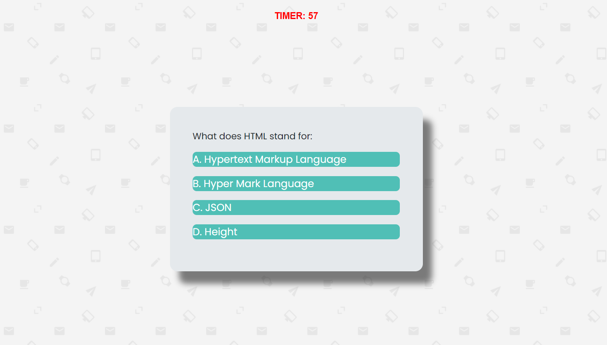

# Code-Quiz

## Description
```
You will have 60 seconds to answer 5 code questions. For each questions you get wrong, 
you'll lose 6 seconds off your timer. At the end, type your initials and see your score.
```

## Table of Contents

* [Description](#description)
* [Installation](#installation)
* [Usage](#usage)
* [Credits](#credits)
* [License](#license)
* [Contributing](#Contributing)
* [Test](#Test)


## Installtion
N/A

## Usage
---





## Credits
```
ANTHONY GUERRERO
```
## License
N/A
## Contributing
N/A
 ## Tests
 N/A
 ## Questions

 

 If you have any questions about the project, repo, or any issue you can contact me at [Anthony Guerrero](https://github.com/knuckleh3ad89) directly.
 


 